# Análise de E-commerce e Logística em SQL

Projeto de portfólio com foco em modelagem de banco de dados, consultas SQL e análise de dados de vendas e logística de um e-commerce fictício. Desenvolvido como parte da minha transição de carreira para Análise de Dados.

## Objetivo

Simular o banco de dados de um e-commerce (clientes, produtos, vendedores, pedidos, itens e entregas) e responder perguntas de negócio reais usando SQL: faturamento, produtos mais vendidos, performance de vendedores, tempo de entrega e taxa de atraso por transportadora.

## Tecnologias

- MySQL
- MySQL Workbench

## Modelo de Dados

**Tabelas:** `clientes`, `produtos`, `vendedores`, `pedidos`, `itens_pedido`, `entregas`

**Relacionamentos:**
- `clientes` (1) → `pedidos` (N)
- `pedidos` (1) → `itens_pedido` (N)
- `produtos` (1) → `itens_pedido` (N)
- `vendedores` (1) → `itens_pedido` (N)
- `pedidos` (1) → `entregas` (1)

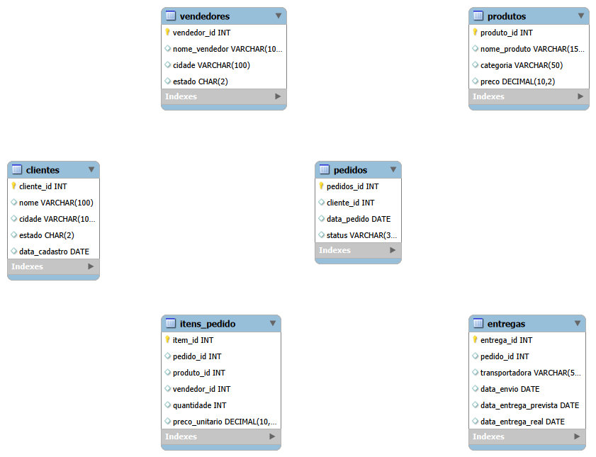

O schema completo com os comandos `CREATE TABLE` está em [`sql/01_criacao_tabelas.sql`](sql/01_criacao_tabelas.sql), e os dados fictícios usados nas análises estão em [`sql/02_insercao_dados.sql`](sql/02_insercao_dados.sql).

---

## Análise de Vendas

Queries completas em [`sql/03_analise_vendas.sql`](sql/03_analise_vendas.sql).

### 1. Faturamento Total

Faturamento total considerando apenas pedidos com status "entregue".

```sql
SELECT 
    SUM(ip.quantidade * ip.preco_unitario) AS faturamento_total
FROM itens_pedido ip
JOIN pedidos p ON ip.pedido_id = p.pedido_id
WHERE p.status = 'entregue';
```

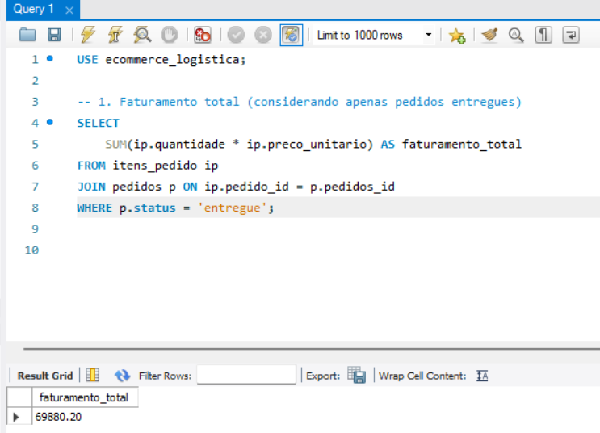

### 2. Ticket Médio por Pedido

Valor médio gasto por pedido entregue.

```sql
SELECT 
    ROUND(AVG(total_pedido), 2) AS ticket_medio
FROM (
    SELECT ip.pedido_id, SUM(ip.quantidade * ip.preco_unitario) AS total_pedido
    FROM itens_pedido ip
    JOIN pedidos p ON ip.pedido_id = p.pedido_id
    WHERE p.status = 'entregue'
    GROUP BY ip.pedido_id
) AS subtotal;
```

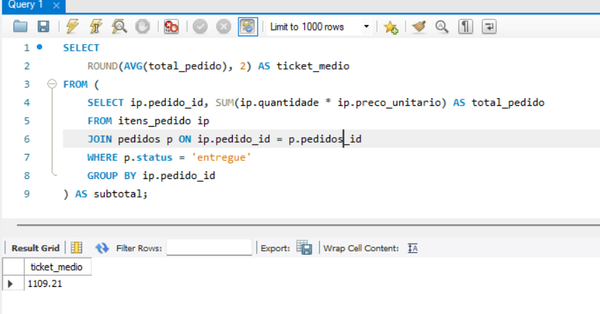

### 3. Top 5 Produtos Mais Vendidos

Os 5 produtos com maior volume de unidades vendidas no período.

```sql
SELECT 
    pr.nome_produto,
    SUM(ip.quantidade) AS total_vendido
FROM itens_pedido ip
JOIN produtos pr ON ip.produto_id = pr.produto_id
GROUP BY pr.nome_produto
ORDER BY total_vendido DESC
LIMIT 5;
```

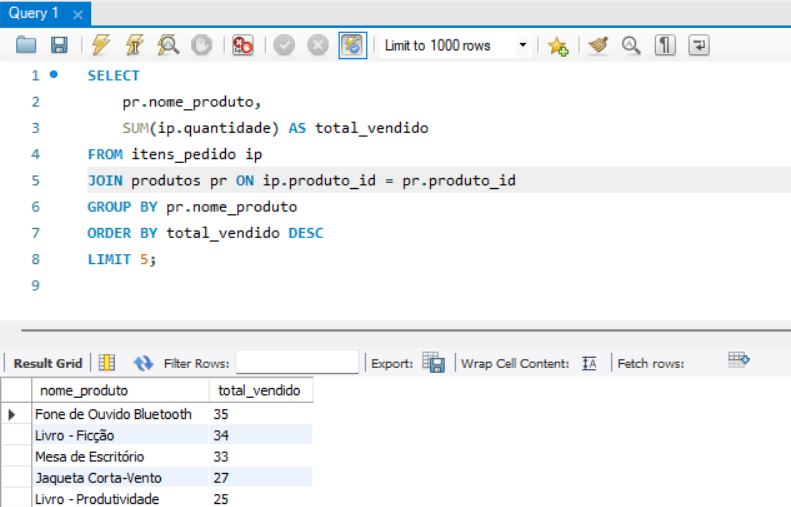

### 4. Faturamento por Categoria de Produto

Faturamento total agrupado por categoria de produto.

```sql
SELECT 
    pr.categoria,
    ROUND(SUM(ip.quantidade * ip.preco_unitario), 2) AS faturamento
FROM itens_pedido ip
JOIN produtos pr ON ip.produto_id = pr.produto_id
GROUP BY pr.categoria
ORDER BY faturamento DESC;
```

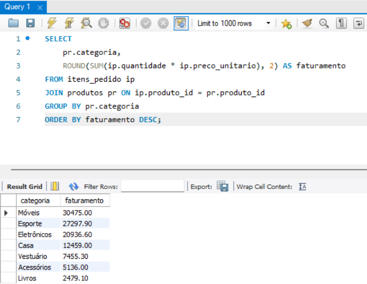

### 5. Faturamento por Estado do Cliente

Faturamento agrupado pelo estado do cliente, mostrando as regiões mais fortes em vendas.

```sql
SELECT 
    c.estado,
    ROUND(SUM(ip.quantidade * ip.preco_unitario), 2) AS faturamento
FROM itens_pedido ip
JOIN pedidos p ON ip.pedido_id = p.pedido_id
JOIN clientes c ON p.cliente_id = c.cliente_id
GROUP BY c.estado
ORDER BY faturamento DESC;
```

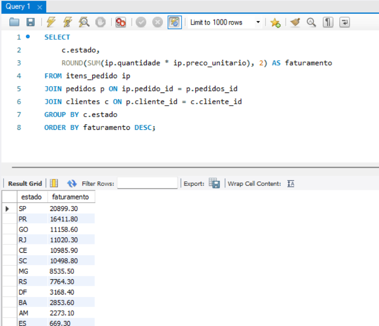

### 6. Evolução Mensal do Faturamento

Faturamento mês a mês, útil para identificar tendência de crescimento ou sazonalidade.

```sql
SELECT 
    DATE_FORMAT(p.data_pedido, '%Y-%m') AS mes,
    ROUND(SUM(ip.quantidade * ip.preco_unitario), 2) AS faturamento_mes
FROM itens_pedido ip
JOIN pedidos p ON ip.pedido_id = p.pedido_id
WHERE p.status = 'entregue'
GROUP BY mes
ORDER BY mes;
```

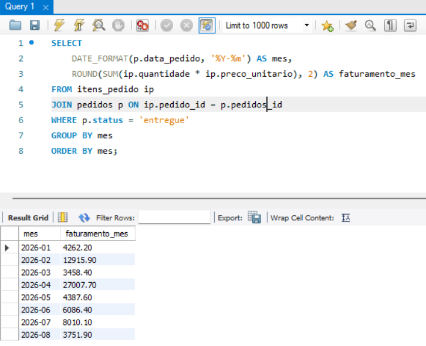

### 7. Ranking de Vendedores por Faturamento

Vendedores ordenados por faturamento total, usando a função de janela `RANK()`.

```sql
SELECT 
    v.nome_vendedor,
    ROUND(SUM(ip.quantidade * ip.preco_unitario), 2) AS faturamento,
    RANK() OVER (ORDER BY SUM(ip.quantidade * ip.preco_unitario) DESC) AS ranking
FROM itens_pedido ip
JOIN vendedores v ON ip.vendedor_id = v.vendedor_id
GROUP BY v.nome_vendedor
ORDER BY faturamento DESC;
```

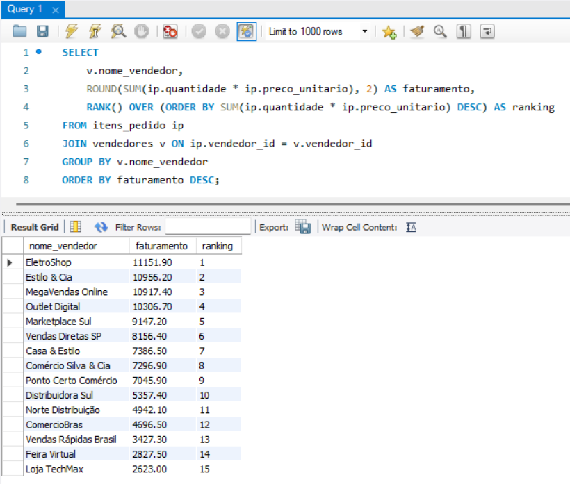

### 8. Distribuição de Status dos Pedidos

Distribuição percentual dos pedidos por status (entregue, cancelado, em transporte).

```sql
SELECT 
    status,
    COUNT(*) AS total,
    ROUND(COUNT(*) * 100.0 / (SELECT COUNT(*) FROM pedidos), 2) AS percentual
FROM pedidos
GROUP BY status;
```

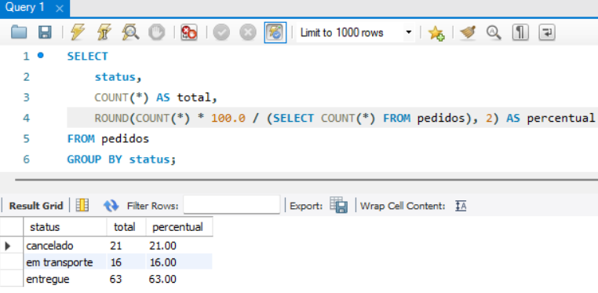

### 9. Top 5 Clientes por Valor Gasto

Clientes que mais geraram receita entre os pedidos entregues (análise tipo RFM – Valor).

```sql
SELECT 
    c.nome,
    COUNT(DISTINCT p.pedido_id) AS qtd_pedidos,
    ROUND(SUM(ip.quantidade * ip.preco_unitario), 2) AS total_gasto
FROM itens_pedido ip
JOIN pedidos p ON ip.pedido_id = p.pedido_id
JOIN clientes c ON p.cliente_id = c.cliente_id
WHERE p.status = 'entregue'
GROUP BY c.nome
ORDER BY total_gasto DESC
LIMIT 5;
```

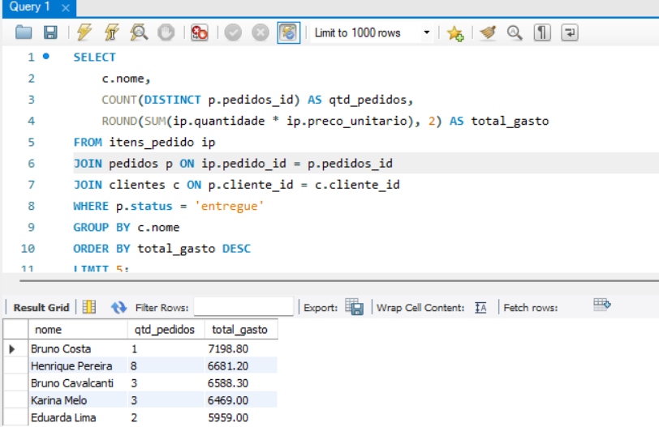

---

## Análise de Logística

Queries completas em [`sql/04_logistica.sql`](sql/04_logistica.sql).

### 10. Tempo Médio de Entrega por Transportadora

Média de dias entre envio e entrega real, por transportadora — mostra qual é mais rápida.

```sql
SELECT 
    transportadora,
    ROUND(AVG(DATEDIFF(data_entrega_real, data_envio)), 1) AS media_dias_entrega
FROM entregas
WHERE data_entrega_real IS NOT NULL
GROUP BY transportadora
ORDER BY media_dias_entrega ASC;
```

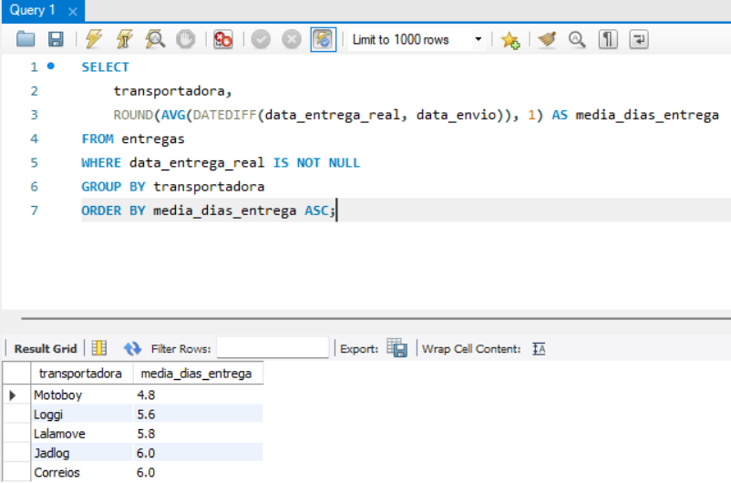

### 11. Taxa de Atraso por Transportadora

Percentual de entregas que ultrapassaram o prazo previsto, por transportadora.

```sql
SELECT 
    transportadora,
    COUNT(*) AS total_entregas,
    SUM(CASE WHEN data_entrega_real > data_entrega_prevista THEN 1 ELSE 0 END) AS atrasos,
    ROUND(SUM(CASE WHEN data_entrega_real > data_entrega_prevista THEN 1 ELSE 0 END) * 100.0 / COUNT(*), 1) AS pct_atraso
FROM entregas
WHERE data_entrega_real IS NOT NULL
GROUP BY transportadora
ORDER BY pct_atraso ASC;
```

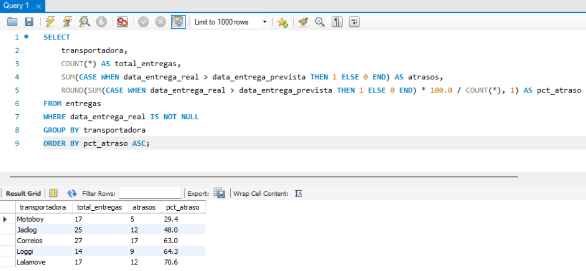

### 12. Volume de Pedidos por Transportadora

Quantidade de entregas atribuídas a cada transportadora.

```sql
SELECT 
    transportadora, 
    COUNT(*) AS total_pedidos
FROM entregas
GROUP BY transportadora
ORDER BY total_pedidos DESC;
```

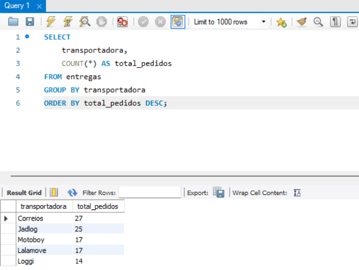

### 13. Top 5 Pedidos com Maior Atraso

Os pedidos com maior número de dias de atraso na entrega.

```sql
SELECT 
    e.pedido_id, 
    e.transportadora,
    DATEDIFF(data_entrega_real, data_entrega_prevista) AS dias_atraso
FROM entregas e
WHERE data_entrega_real IS NOT NULL
  AND data_entrega_real > data_entrega_prevista
ORDER BY dias_atraso DESC
LIMIT 5;
```

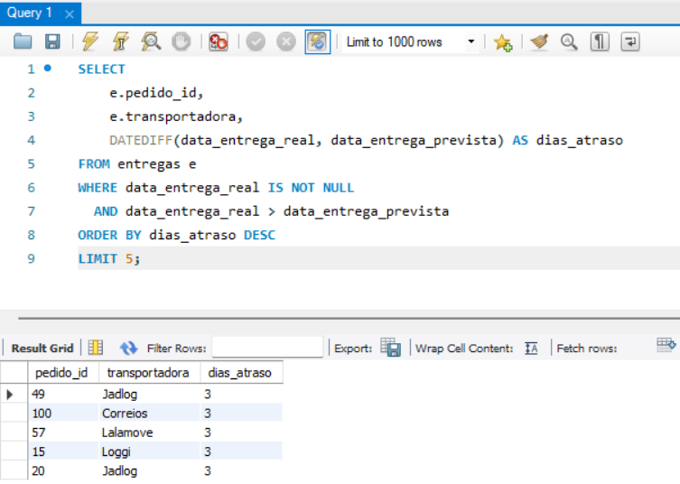

### 14. Entregas Ainda Sem Confirmação

Quantidade de entregas ainda sem data de entrega real registrada.

```sql
SELECT 
    COUNT(*) AS entregas_sem_confirmacao
FROM entregas
WHERE data_entrega_real IS NULL;
```

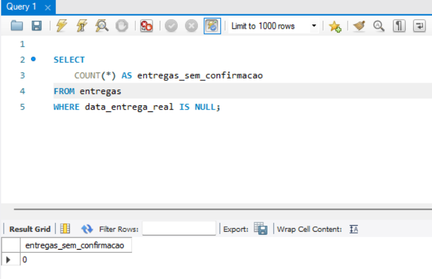

---

## Estrutura do Projeto

```
analise-ecommerce-sql/
├── sql/
│   ├── 01_criacao_tabelas.sql
│   ├── 02_insercao_dados.sql
│   ├── 03_analise_vendas.sql
│   └── 04_logistica.sql
├── images/
│   ├── diagrama_er.png
│   └── (prints dos resultados)
└── README.md
```

## Sobre o autor

Paulo Ricardo — formado em Análise e Desenvolvimento de Sistemas, em transição de carreira para Análise de Dados.

[LinkedIn](https://www.linkedin.com/in/paulo-ricardo-de-sousa-desenvolvedor/) · [GitHub](https://github.com/Pauloricardo2017)
